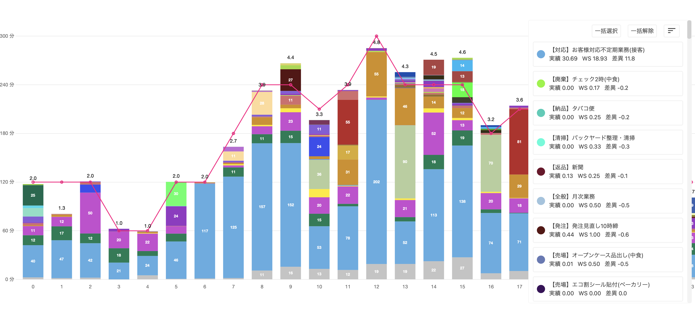

# (Frontend - part 1) ChartJs Example project with Blazor (ChartJsExample)

## Overview  
This project is an example implementation using .NET Blazor Web Assemble + ChartJs

## Dependencies  
- .NET Blazor Web Assemble: Tested with dotnet6  
- ChartJs: https://www.chartjs.org/docs/latest/getting-started/usage.html

## How to try  
(We assume you have already set up dotnet6, if not, check the tutorial: https://dotnet.microsoft.com/en-us/learn/aspnet/blazor-tutorial/install )  
Build and run project:  
- With Visual Studio, try "Build Solution" -> "Debug Run"  
- With CLI, use `dotnet run` command under the project folder, ./ChartJsExample  

## Code architecture  
- `wwwroot/scripts/chartjs_app.js` : javascript application logic that manipulates ChartJs library  
- `Shared/Chart/Gateways/ChartJsInterop.cs` : Interop code to use `chartjs_app.js` from C# and Javascript  
- `Shared/Chart/Views/RenderChart.razor` : View implementation that shows example implementation of graph-chart using ChartJs  

## Assignment  
Modify `Shared/RenderChart.razor`, an chart view to visualize the test data to meet the following requirements  
If you run the project, you'll see test data as json string at https://localhost:7194/. This is an example data of our robot's maintenance report. You will also see an example graph-chart on the same page.  

- Task 1. Modify the graph-chart to show the following;  
    - The horizontal axis should show each date (`WorkDate` in the json)  
    - The vertical axis should show the time (minutes)  
    - Plot each date's total `WorkTime.Maintenance` (if we visited stores a few times on a day, the sum of WorkTime.Maintenance should be plotted)  
    - The chart should be "Line Chart"  
    - The horizontal axis should show the recent 7days from the latest date in the received data  

- Task 2. Add the following functions to what you made at Task1;  
    - Add a UI to select the latest date to show the line chart. If you changed that date, then line chart will render it according to that new-date-range  

# (Frontend - part 2) Chart.js + React (ReactAssignment)
## Overview  
This project need to show an interactive graph using react typescript and Chart.js framework

## Dependencies  
- Node.js (project is using 14.18.1)
- ChartJs: https://www.chartjs.org/docs/latest/getting-started/usage.html

## Code architecture  
It's an empty project, so there is no specific code architecture yet
- `json_data/ws.json` : data of the work schedule to show in the bar graph
- `json_data/tasks.json` : data describing details of each task

## Assignment  
- Task 1. Create a bar graph representing the work schedule like in the image below
- Task 2. Create a floating panel which allow following functionalities
   - Enable/Disable all tasks
   - Enable/Disable single task

   When enable/disable a single task or all tasks, graph and panel need to reflect the changes.
   - enable task -> show in the graph and active state in the panel
   - disable task -> hide from the graph and inactive state in the panel (ex. gray out)

## Notes:  
- If you have any question to proceed the assignment, feel free to ask on slack  
- Please submit the followings as your assignment results  
    - The code itself, push to git  
    - Text report to explain how long time you spent for what part through the assignment  
- We assume you will use less than 10 hours. If you reached the time-limit, please submit your working-results at the time  